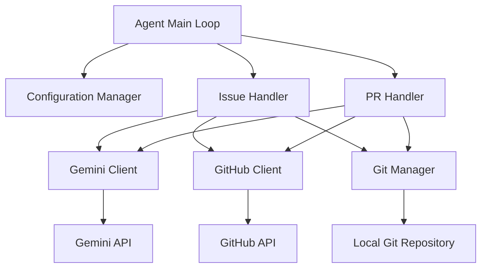
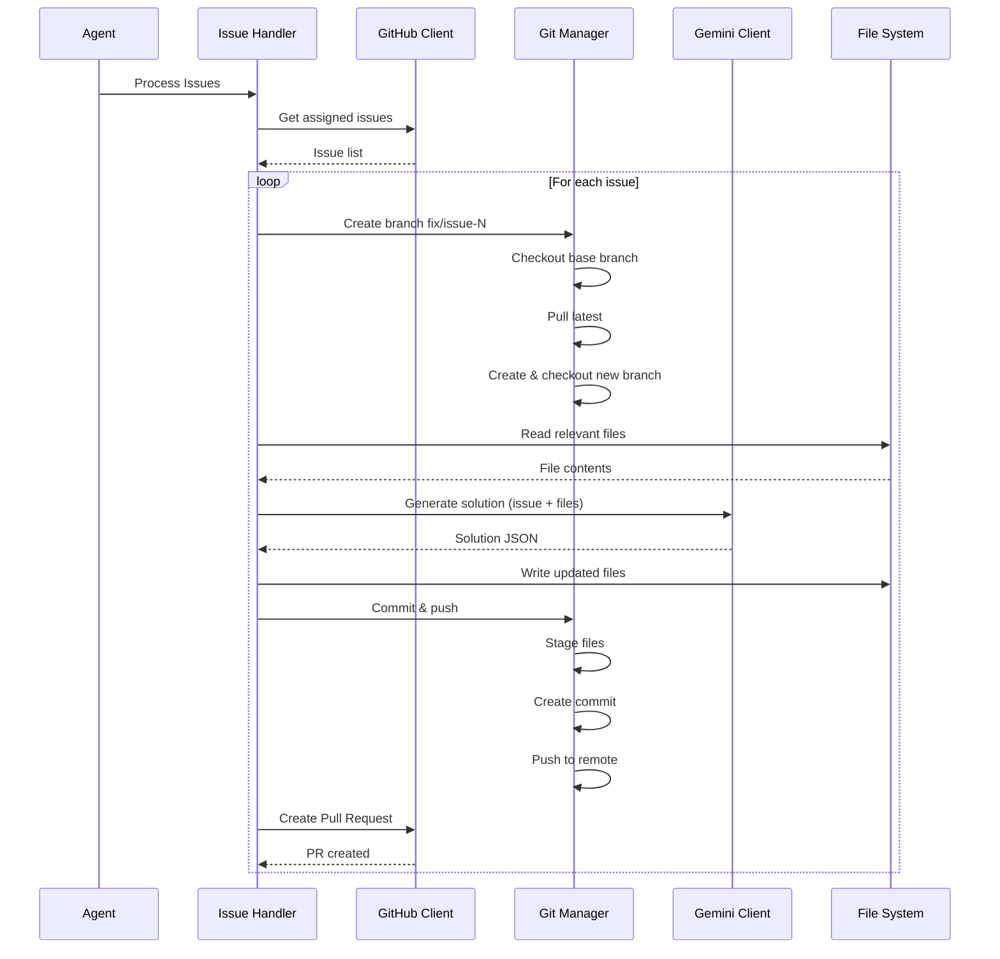
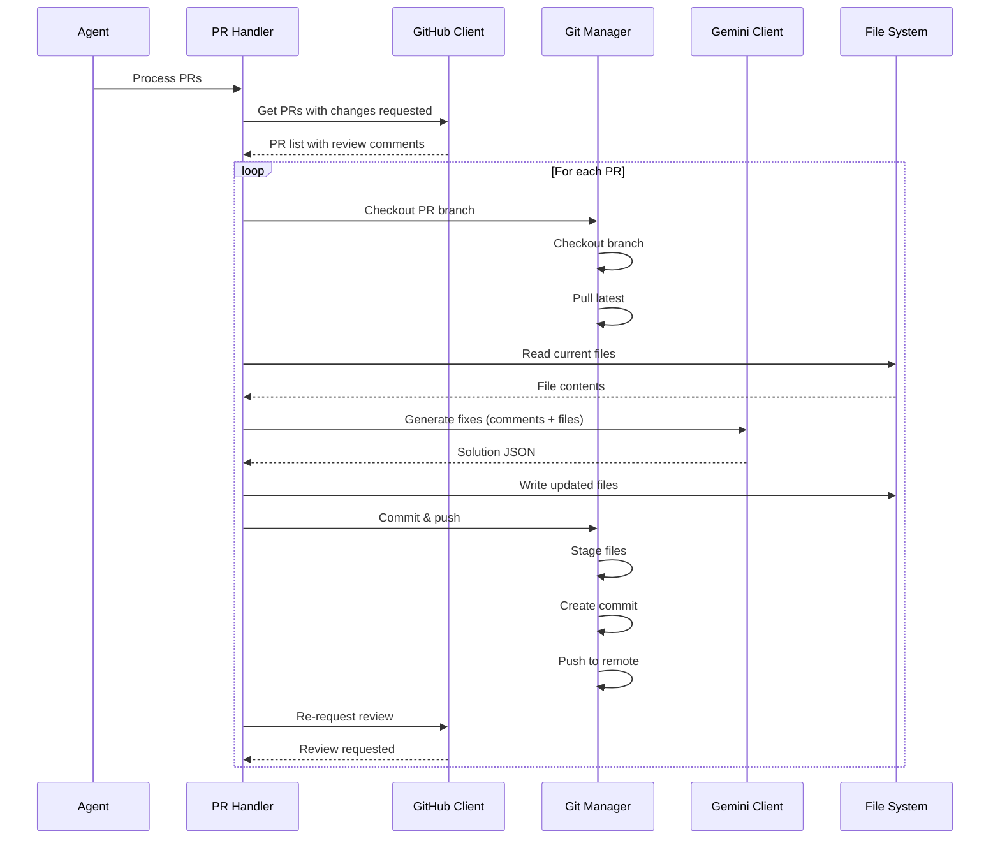

# Design Document: GitHub AI Agent

## Overview

GitHub AI Agent adalah autonomous Python script yang berjalan di mesin lokal untuk mengotomatisasi penanganan GitHub Issues dan Pull Request reviews. Agent mengintegrasikan tiga komponen utama: Gemini API untuk code generation, GitHub API untuk repository management, dan Git operations untuk local version control.

### Core Workflow

Agent beroperasi dalam dua mode utama:

1. **Issue Handler Mode**: Mendeteksi assigned issues, generate solusi kode menggunakan AI, membuat branch baru, apply changes, dan create Pull Request
2. **PR Handler Mode**: Mendeteksi PRs dengan status "changes requested", generate fixes berdasarkan review comments, apply fixes, dan re-request review

### Key Design Principles

- **Autonomous Operation**: Agent berjalan tanpa intervensi manual, menangani multiple issues/PRs dalam satu execution
- **Error Isolation**: Failure pada satu issue/PR tidak menghentikan processing items lainnya
- **Idempotency**: Operations dapat di-retry safely tanpa side effects berbahaya
- **Traceability**: Setiap action ter-log dengan context lengkap untuk debugging

## Architecture

### High-Level Architecture



### Component Layers

**Layer 1: Entry Point**
- `Agent Main Loop`: Orchestrates workflow, handles high-level error recovery

**Layer 2: Workflow Handlers**
- `Issue Handler`: Manages issue-to-PR workflow
- `PR Handler`: Manages PR review feedback workflow

**Layer 3: Service Clients**
- `Gemini Client`: AI code generation service
- `GitHub Client`: GitHub API operations
- `Git Manager`: Local git operations

**Layer 4: External Systems**
- Gemini API (remote)
- GitHub API (remote)
- Local Git Repository (local filesystem)

### Data Flow

#### Issue Handling Flow



#### PR Review Handling Flow



## Components and Interfaces

### 1. Configuration Manager

**Responsibility**: Load dan validate configuration dari environment variables atau config file.

**Interface**:
```python
class Configuration:
    gemini_api_key: str
    github_token: str
    repo_name: str  # format: 'org/repo-name'
    local_dir_path: Path
    default_target_base_branch: str  # default: 'main'
    
    @classmethod
    def load() -> Configuration:
        """Load configuration from environment or config file.
        Raises ConfigurationError if required values missing."""
        pass
    
    def validate(self) -> None:
        """Validate all configuration values.
        Raises ConfigurationError if invalid."""
        pass
```

**Dependencies**: None (pure configuration)

**Error Handling**:
- Raises `ConfigurationError` jika required values missing
- Validates format repo_name (must contain '/')
- Validates local_dir_path exists dan is a directory

---

### 2. Gemini Client

**Responsibility**: Communicate dengan Gemini API untuk code generation, enforce JSON output format.

**Interface**:
```python
class GeminiClient:
    def __init__(self, api_key: str):
        """Initialize Gemini client with API key."""
        pass
    
    def generate_solution(
        self, 
        prompt: str, 
        system_instruction: str
    ) -> dict:
        """Generate code solution from prompt.
        
        Returns:
            dict: Solution JSON with structure:
                {
                    "files": [
                        {
                            "file_path": "path/to/file.py",
                            "content": "updated file content"
                        }
                    ]
                }
        
        Raises:
            GeminiAPIError: If API call fails after retries
            JSONParseError: If response is not valid JSON
        """
        pass
    
    def _extract_json_from_markdown(self, response: str) -> dict:
        """Extract JSON from markdown code blocks if present."""
        pass
```

**Configuration**:
- Temperature: 0.2 (for deterministic output)
- Max retries: 3
- Timeout: 60 seconds

**System Prompt Template**:
```
You are a code generation assistant. You must respond ONLY with valid JSON.

Output format:
{
  "files": [
    {
      "file_path": "relative/path/to/file.py",
      "content": "complete updated file content"
    }
  ]
}

Do not include any explanation or markdown formatting. Only return the JSON object.
```

**Dependencies**: 
- `google-generativeai` library
- Configuration (for API key)

**Error Handling**:
- Retry up to 3 times on API errors
- Extract JSON from markdown code blocks if wrapped
- Validate JSON structure before returning
- Log all API interactions for debugging

---

### 3. GitHub Client

**Responsibility**: Interact dengan GitHub API untuk issues, PRs, dan reviews.

**Interface**:
```python
class GitHubClient:
    def __init__(self, token: str, repo_name: str):
        """Initialize GitHub client with token and repo."""
        pass
    
    def get_assigned_issues(self) -> list[Issue]:
        """Get open issues assigned to authenticated user.
        
        Returns:
            list[Issue]: List of Issue objects with number, title, body
        """
        pass
    
    def get_prs_with_changes_requested(self) -> list[PullRequest]:
        """Get PRs created by user with latest review state CHANGES_REQUESTED.
        
        Returns:
            list[PullRequest]: List of PR objects with number, branch, comments
        """
        pass
    
    def create_pull_request(
        self,
        title: str,
        body: str,
        head_branch: str,
        base_branch: str
    ) -> PullRequest:
        """Create a new Pull Request.
        
        Raises:
            GitHubAPIError: If PR creation fails
        """
        pass
    
    def request_review(self, pr_number: int, reviewers: list[str]) -> None:
        """Re-request review from specified reviewers.
        
        Raises:
            GitHubAPIError: If review request fails
        """
        pass
    
    def get_review_comments(self, pr_number: int) -> list[ReviewComment]:
        """Get review comments for a PR.
        
        Returns:
            list[ReviewComment]: Comments with body, file, line info
        """
        pass
```

**Data Models**:
```python
@dataclass
class Issue:
    number: int
    title: str
    body: str

@dataclass
class PullRequest:
    number: int
    title: str
    head_branch: str
    base_branch: str

@dataclass
class ReviewComment:
    body: str
    file_path: str
    line: int
    reviewer: str
```

**Dependencies**:
- `PyGithub` library
- Configuration (for token and repo_name)

**Error Handling**:
- Wrap all PyGithub exceptions in custom `GitHubAPIError`
- Log API rate limit status
- Retry on transient network errors

---

### 4. Git Manager

**Responsibility**: Manage local git operations (branch, commit, push).

**Interface**:
```python
class GitManager:
    def __init__(self, repo_path: Path):
        """Initialize Git manager with local repository path.
        
        Raises:
            GitError: If repo_path is not a valid git repository
        """
        pass
    
    def checkout_and_pull(self, branch_name: str) -> None:
        """Checkout to branch and pull latest changes.
        
        Raises:
            GitError: If checkout or pull fails
        """
        pass
    
    def create_branch(self, branch_name: str, base_branch: str) -> None:
        """Create new branch from base_branch and checkout to it.
        
        Steps:
        1. Checkout to base_branch
        2. Pull latest changes
        3. Create new branch
        4. Checkout to new branch
        
        Raises:
            GitError: If any step fails
        """
        pass
    
    def commit_and_push(
        self, 
        commit_message: str, 
        branch_name: str
    ) -> None:
        """Stage all changes, commit, and push to remote.
        
        Raises:
            GitError: If commit or push fails
        """
        pass
    
    def get_current_branch(self) -> str:
        """Get name of current branch."""
        pass
```

**Dependencies**:
- `GitPython` library
- Configuration (for local_dir_path)

**Error Handling**:
- Wrap all GitPython exceptions in custom `GitError`
- Validate repository state before operations
- Log all git commands executed

---

### 5. Issue Handler

**Responsibility**: Orchestrate issue-to-PR workflow.

**Interface**:
```python
class IssueHandler:
    def __init__(
        self,
        github_client: GitHubClient,
        gemini_client: GeminiClient,
        git_manager: GitManager,
        config: Configuration
    ):
        pass
    
    def process_issues(self) -> ProcessingResult:
        """Process all assigned issues.
        
        For each issue:
        1. Create feature branch
        2. Generate solution using AI
        3. Apply changes to local files
        4. Commit and push
        5. Create Pull Request
        
        Returns:
            ProcessingResult: Summary of successful and failed operations
        """
        pass
    
    def _process_single_issue(self, issue: Issue) -> bool:
        """Process a single issue. Returns True if successful."""
        pass
    
    def _read_relevant_files(self, issue: Issue) -> dict[str, str]:
        """Read files relevant to the issue from local repository.
        
        Strategy: Read all Python files in repository (can be optimized later)
        """
        pass
    
    def _construct_prompt(
        self, 
        issue: Issue, 
        file_contents: dict[str, str]
    ) -> str:
        """Construct prompt for Gemini API."""
        pass
    
    def _apply_solution(self, solution: dict) -> None:
        """Apply solution JSON to local files.
        
        Raises:
            FileWriteError: If file write fails
        """
        pass
```

**Dependencies**:
- GitHubClient
- GeminiClient
- GitManager
- Configuration

**Error Handling**:
- Catch and log errors for each issue
- Continue processing remaining issues after error
- Return summary of successes and failures

---

### 6. PR Handler

**Responsibility**: Orchestrate PR review feedback workflow.

**Interface**:
```python
class PRHandler:
    def __init__(
        self,
        github_client: GitHubClient,
        gemini_client: GeminiClient,
        git_manager: GitManager,
        config: Configuration
    ):
        pass
    
    def process_prs(self) -> ProcessingResult:
        """Process all PRs with changes requested.
        
        For each PR:
        1. Checkout to PR branch
        2. Generate fixes based on review comments
        3. Apply fixes to local files
        4. Commit and push
        5. Re-request review
        
        Returns:
            ProcessingResult: Summary of successful and failed operations
        """
        pass
    
    def _process_single_pr(self, pr: PullRequest) -> bool:
        """Process a single PR. Returns True if successful."""
        pass
    
    def _construct_fix_prompt(
        self,
        pr: PullRequest,
        comments: list[ReviewComment],
        file_contents: dict[str, str]
    ) -> str:
        """Construct prompt for generating fixes."""
        pass
    
    def _apply_fixes(self, solution: dict) -> None:
        """Apply fix solution JSON to local files."""
        pass
    
    def _get_reviewers_who_requested_changes(
        self, 
        pr: PullRequest
    ) -> list[str]:
        """Extract reviewer usernames who requested changes."""
        pass
```

**Dependencies**:
- GitHubClient
- GeminiClient
- GitManager
- Configuration

**Error Handling**:
- Catch and log errors for each PR
- Continue processing remaining PRs after error
- Return summary of successes and failures

---

### 7. Agent Main Loop

**Responsibility**: Entry point, orchestrate both workflows, handle global errors.

**Interface**:
```python
class Agent:
    def __init__(self, config: Configuration):
        """Initialize agent with all components."""
        pass
    
    def run(self) -> int:
        """Run agent workflows.
        
        Steps:
        1. Process assigned issues
        2. Process PRs with changes requested
        3. Log summary
        
        Returns:
            int: Exit code (0 for success, 1 for critical error)
        """
        pass
    
    def _log_summary(
        self,
        issue_result: ProcessingResult,
        pr_result: ProcessingResult
    ) -> None:
        """Log summary of all operations."""
        pass
```

**Dependencies**: All components

**Error Handling**:
- Catch critical errors and exit with non-zero code
- Log all operations with timestamps
- Ensure cleanup on exit

## Data Models

### Core Data Structures

```python
from dataclasses import dataclass
from pathlib import Path
from typing import Optional
from datetime import datetime

@dataclass
class Configuration:
    """Agent configuration loaded from environment."""
    gemini_api_key: str
    github_token: str
    repo_name: str
    local_dir_path: Path
    default_target_base_branch: str = "main"

@dataclass
class Issue:
    """GitHub Issue representation."""
    number: int
    title: str
    body: str
    assignee: str

@dataclass
class PullRequest:
    """GitHub Pull Request representation."""
    number: int
    title: str
    head_branch: str
    base_branch: str
    author: str

@dataclass
class ReviewComment:
    """GitHub Review Comment representation."""
    body: str
    file_path: Optional[str]
    line: Optional[int]
    reviewer: str
    created_at: datetime

@dataclass
class SolutionFile:
    """Single file in solution JSON."""
    file_path: str
    content: str

@dataclass
class Solution:
    """AI-generated solution."""
    files: list[SolutionFile]
    
    @classmethod
    def from_json(cls, data: dict) -> "Solution":
        """Parse solution from JSON response."""
        files = [
            SolutionFile(
                file_path=f["file_path"],
                content=f["content"]
            )
            for f in data["files"]
        ]
        return cls(files=files)

@dataclass
class ProcessingResult:
    """Result of processing multiple items."""
    total: int
    successful: int
    failed: int
    errors: list[str]
    
    def add_success(self) -> None:
        self.successful += 1
    
    def add_failure(self, error: str) -> None:
        self.failed += 1
        self.errors.append(error)
```

### Solution JSON Schema

Format yang dikembalikan oleh Gemini API:

```json
{
  "files": [
    {
      "file_path": "src/main.py",
      "content": "def main():\n    print('Hello, World!')\n"
    },
    {
      "file_path": "tests/test_main.py",
      "content": "def test_main():\n    assert True\n"
    }
  ]
}
```

**Validation Rules**:
- `files` must be an array
- Each file must have `file_path` (string) and `content` (string)
- `file_path` must be relative path (no absolute paths)
- `content` must be complete file content (not diffs)

### Error Types

```python
class AgentError(Exception):
    """Base exception for all agent errors."""
    pass

class ConfigurationError(AgentError):
    """Configuration loading or validation error."""
    pass

class GitHubAPIError(AgentError):
    """GitHub API operation error."""
    pass

class GeminiAPIError(AgentError):
    """Gemini API operation error."""
    pass

class JSONParseError(AgentError):
    """JSON parsing error."""
    pass

class GitError(AgentError):
    """Git operation error."""
    pass

class FileWriteError(AgentError):
    """File write operation error."""
    pass
```


## Correctness Properties

*A property is a characteristic or behavior that should hold true across all valid executions of a system-essentially, a formal statement about what the system should do. Properties serve as the bridge between human-readable specifications and machine-verifiable correctness guarantees.*

### Property 1: Configuration Loading Completeness

*For any* valid environment or config file containing all required fields (GEMINI_API_KEY, GITHUB_TOKEN, REPO_NAME, LOCAL_DIR_PATH), the Configuration should successfully load all values and make them accessible.

**Validates: Requirements 1.1, 1.2, 1.3, 1.4**

### Property 2: Configuration Default Values

*For any* configuration where DEFAULT_TARGET_BASE_BRANCH is not provided, the Configuration should default to 'main', and when provided, it should use the provided value.

**Validates: Requirements 1.5**

### Property 3: Configuration Validation Errors

*For any* configuration missing one or more required fields, the Configuration should raise a ConfigurationError with a descriptive message indicating which field is missing.

**Validates: Requirements 1.6**

### Property 4: Issue Filtering Correctness

*For any* set of GitHub issues, the Issue_Handler should return only issues that are assigned to the authenticated user and are in open state.

**Validates: Requirements 2.2**

### Property 5: Issue Data Completeness

*For any* issue returned by Issue_Handler, the issue object should contain populated number, title, and body fields.

**Validates: Requirements 2.3**

### Property 6: Branch Naming Format

*For any* issue number N, the Git_Manager should create a branch with the exact format 'fix/issue-N' where N is the issue number.

**Validates: Requirements 3.3**

### Property 7: Branch Creation State Transition

*For any* successful branch creation operation, the Git_Manager's current branch should be the newly created branch after the operation completes.

**Validates: Requirements 3.1, 3.2, 3.3, 3.4**

### Property 8: Prompt Construction Completeness

*For any* issue and set of file contents, the constructed prompt should contain both the issue description and all file contents.

**Validates: Requirements 4.2, 10.2**

### Property 9: Gemini API JSON Response Format

*For any* successful Gemini API call, the response should be valid JSON conforming to the Solution schema with a "files" array where each element has "file_path" and "content" fields.

**Validates: Requirements 4.3, 4.4, 10.3, 10.4, 14.4**

### Property 10: JSON Extraction from Markdown

*For any* response string containing JSON wrapped in markdown code blocks (```json ... ```), the Gemini_Client should successfully extract and parse the JSON content.

**Validates: Requirements 14.5**

### Property 11: Retry on Invalid JSON

*For any* Gemini API response that is not valid JSON, the Gemini_Client should retry the request up to the configured maximum retry count before failing.

**Validates: Requirements 4.5, 10.5**

### Property 12: Solution Application Completeness

*For any* Solution JSON containing N files, the handler should write exactly N files to the local filesystem at the specified paths.

**Validates: Requirements 5.1, 5.2, 11.1, 11.2**

### Property 13: File Attribute Preservation

*For any* file that exists before solution application, after writing new content, the file should retain its original permissions and encoding.

**Validates: Requirements 5.3**

### Property 14: Commit Message Format for Issues

*For any* issue with number N and title T, the Git_Manager should create a commit with message format 'Fix issue #N: T'.

**Validates: Requirements 6.2**

### Property 15: Commit Message Format for PR Fixes

*For any* PR fix commit, the Git_Manager should create a commit with the exact message 'Address review comments'.

**Validates: Requirements 11.4**

### Property 16: Pull Request Title Format

*For any* issue with number N and title T, the GitHub_Client should create a PR with title format 'Fix issue #N: T'.

**Validates: Requirements 7.2**

### Property 17: Pull Request Body Issue Reference

*For any* issue with number N, the GitHub_Client should create a PR with body containing the text 'Closes #N'.

**Validates: Requirements 7.3**

### Property 18: PR Filtering by Review State

*For any* set of Pull Requests, the PR_Handler should return only PRs created by the authenticated user where the latest review state is 'CHANGES_REQUESTED'.

**Validates: Requirements 8.2**

### Property 19: PR Data Completeness

*For any* PR returned by PR_Handler, the PR object should contain populated number, branch name, and review comments fields.

**Validates: Requirements 8.3**

### Property 20: Reviewer Identification

*For any* PR with review comments, the GitHub_Client should correctly identify all unique reviewers who have requested changes.

**Validates: Requirements 12.1**

### Property 21: Error Isolation in Batch Processing

*For any* list of items (issues or PRs) where processing one item fails, the Agent should continue processing all remaining items in the list.

**Validates: Requirements 3.5, 13.2**

### Property 22: Error Logging Completeness

*For any* error that occurs during processing, the Agent should log an entry containing timestamp, error type, error message, and context (issue/PR number).

**Validates: Requirements 13.1**

### Property 23: Processing Summary Completeness

*For any* agent execution, the final summary should include total count, successful count, failed count, and list of error messages.

**Validates: Requirements 13.3**

### Property 24: Critical Error Exit Code

*For any* critical error (configuration failure, repository not found), the Agent should exit with a non-zero status code.

**Validates: Requirements 13.4**

### Property 25: Gemini System Prompt Configuration

*For any* Gemini API call, the request should include a system prompt that explicitly instructs JSON-only output and specifies the expected schema structure.

**Validates: Requirements 14.1, 14.2**

### Property 26: Gemini Temperature Configuration

*For any* Gemini API call, the temperature parameter should be set to 0.2 or lower to ensure deterministic output.

**Validates: Requirements 14.3**

### Property 27: Git Operations Rollback on File Write Failure

*For any* file write operation that fails during solution application, the Git_Manager should rollback all changes made in the current operation (unstage files or reset to previous commit).

**Validates: Requirements 5.4**

## Error Handling

### Error Categories

**1. Configuration Errors (Fatal)**
- Missing required environment variables
- Invalid repository path
- Invalid repository name format
- Action: Exit immediately with non-zero code and descriptive error

**2. GitHub API Errors (Recoverable)**
- Rate limit exceeded
- Network timeout
- Invalid credentials
- Action: Log error, skip current item, continue with next

**3. Gemini API Errors (Recoverable with Retry)**
- Invalid JSON response
- Network timeout
- API quota exceeded
- Action: Retry up to 3 times, then log error and skip current item

**4. Git Operation Errors (Recoverable)**
- Branch already exists
- Merge conflicts
- Push rejected
- Action: Log error, skip current item, continue with next

**5. File System Errors (Recoverable with Rollback)**
- Permission denied
- Disk full
- Invalid file path
- Action: Rollback changes, log error, skip current item

### Error Handling Strategy

```python
def process_with_error_handling(items: list, process_fn: Callable) -> ProcessingResult:
    """Generic error handling pattern for batch processing."""
    result = ProcessingResult(total=len(items), successful=0, failed=0, errors=[])
    
    for item in items:
        try:
            process_fn(item)
            result.add_success()
        except RecoverableError as e:
            logger.error(f"Error processing {item}: {e}", exc_info=True)
            result.add_failure(str(e))
            # Continue to next item
        except FatalError as e:
            logger.critical(f"Fatal error: {e}", exc_info=True)
            raise
    
    return result
```

### Logging Format

All log entries follow this format:

```
[TIMESTAMP] [LEVEL] [COMPONENT] [CONTEXT] Message
```

Example:
```
[2024-01-15 10:30:45] [ERROR] [IssueHandler] [Issue #123] Failed to apply solution: Permission denied for file src/main.py
[2024-01-15 10:30:46] [INFO] [IssueHandler] [Issue #124] Successfully created PR #456
```

### Retry Configuration

| Operation | Max Retries | Backoff Strategy | Timeout |
|-----------|-------------|------------------|---------|
| Gemini API | 3 | Exponential (1s, 2s, 4s) | 60s per request |
| GitHub API | 2 | Linear (2s, 2s) | 30s per request |
| Git Push | 1 | None | 120s |

## Testing Strategy

### Dual Testing Approach

This feature requires both unit testing and property-based testing for comprehensive coverage:

**Unit Tests** focus on:
- Specific examples of configuration loading
- Edge cases (empty issue list, empty PR list, no reviewers)
- Error conditions (missing config, API failures)
- Integration points between components
- Mocking external dependencies (GitHub API, Gemini API, Git operations)

**Property-Based Tests** focus on:
- Universal properties across all inputs (see Correctness Properties section)
- Comprehensive input coverage through randomization
- Validating format requirements (branch names, commit messages, PR titles)
- Testing error isolation across batch operations

### Property-Based Testing Configuration

**Library**: `hypothesis` for Python

**Configuration**:
- Minimum 100 iterations per property test
- Each test tagged with reference to design document property
- Tag format: `# Feature: github-ai-agent, Property N: [property description]`

**Example Property Test**:

```python
from hypothesis import given, strategies as st
import pytest

@given(issue_number=st.integers(min_value=1, max_value=999999))
def test_branch_naming_format(issue_number):
    """
    Feature: github-ai-agent, Property 6: Branch Naming Format
    
    For any issue number N, the Git_Manager should create a branch 
    with the exact format 'fix/issue-N'.
    """
    git_manager = GitManager(repo_path=TEST_REPO_PATH)
    branch_name = git_manager.generate_branch_name(issue_number)
    
    assert branch_name == f"fix/issue-{issue_number}"
    assert branch_name.startswith("fix/issue-")
    assert branch_name.split("-")[-1] == str(issue_number)
```

### Unit Test Examples

```python
def test_configuration_missing_api_key():
    """Test that missing GEMINI_API_KEY raises ConfigurationError."""
    with pytest.raises(ConfigurationError, match="GEMINI_API_KEY"):
        Configuration.load(env={"GITHUB_TOKEN": "token", "REPO_NAME": "org/repo"})

def test_empty_issue_list_handling():
    """Test that empty issue list is handled gracefully."""
    handler = IssueHandler(mock_github, mock_gemini, mock_git, config)
    result = handler.process_issues()
    
    assert result.total == 0
    assert result.successful == 0
    assert result.failed == 0

def test_gemini_json_extraction_from_markdown():
    """Test JSON extraction from markdown code blocks."""
    response = '```json\n{"files": [{"file_path": "test.py", "content": "code"}]}\n```'
    client = GeminiClient(api_key="test")
    
    result = client._extract_json_from_markdown(response)
    
    assert "files" in result
    assert len(result["files"]) == 1
```

### Integration Testing

**Test Scenarios**:
1. End-to-end issue handling with mocked GitHub and Gemini APIs
2. End-to-end PR handling with mocked GitHub and Gemini APIs
3. Error recovery across multiple issues/PRs
4. Configuration loading from different sources

**Test Environment**:
- Use temporary git repositories for testing
- Mock all external API calls (GitHub, Gemini)
- Use test fixtures for sample issues, PRs, and review comments

### Test Coverage Goals

- Line coverage: > 85%
- Branch coverage: > 80%
- All error paths tested
- All correctness properties implemented as property tests
- All edge cases covered by unit tests

### Testing Dependencies

```
pytest>=7.0.0
pytest-cov>=4.0.0
hypothesis>=6.0.0
pytest-mock>=3.0.0
responses>=0.20.0  # for mocking HTTP requests
```

### Continuous Integration

Tests should run on:
- Every commit to feature branches
- Every pull request
- Before merging to main branch

CI should fail if:
- Any test fails
- Coverage drops below threshold
- Property tests find counterexamples


## Implementation Details

### Project Structure

```
github-ai-agent/
├── src/
│   ├── __init__.py
│   ├── main.py                 # Entry point
│   ├── agent.py                # Agent main loop
│   ├── config.py               # Configuration management
│   ├── handlers/
│   │   ├── __init__.py
│   │   ├── issue_handler.py   # Issue workflow
│   │   └── pr_handler.py      # PR workflow
│   ├── clients/
│   │   ├── __init__.py
│   │   ├── gemini_client.py   # Gemini API client
│   │   └── github_client.py   # GitHub API client
│   ├── git/
│   │   ├── __init__.py
│   │   └── git_manager.py     # Git operations
│   ├── models/
│   │   ├── __init__.py
│   │   └── data_models.py     # Data classes
│   └── utils/
│       ├── __init__.py
│       ├── logger.py          # Logging utilities
│       └── errors.py          # Custom exceptions
├── tests/
│   ├── __init__.py
│   ├── conftest.py            # Pytest fixtures
│   ├── test_config.py
│   ├── test_issue_handler.py
│   ├── test_pr_handler.py
│   ├── test_gemini_client.py
│   ├── test_github_client.py
│   ├── test_git_manager.py
│   └── property_tests/
│       ├── __init__.py
│       ├── test_properties_config.py
│       ├── test_properties_formatting.py
│       ├── test_properties_workflow.py
│       └── test_properties_error_handling.py
├── .env.example               # Example environment variables
├── requirements.txt           # Python dependencies
├── README.md
└── setup.py
```

### Dependencies

```txt
# Core dependencies
google-generativeai>=0.3.0    # Gemini API client
PyGithub>=2.1.0               # GitHub API client
GitPython>=3.1.0              # Git operations
python-dotenv>=1.0.0          # Environment variable loading

# Testing dependencies
pytest>=7.0.0
pytest-cov>=4.0.0
hypothesis>=6.0.0
pytest-mock>=3.0.0
responses>=0.20.0
```

### Environment Configuration

`.env` file format:

```bash
# Required
GEMINI_API_KEY=your_gemini_api_key_here
GITHUB_TOKEN=your_github_personal_access_token
REPO_NAME=organization/repository-name
LOCAL_DIR_PATH=/absolute/path/to/local/repo

# Optional
DEFAULT_TARGET_BASE_BRANCH=main
LOG_LEVEL=INFO
GEMINI_TEMPERATURE=0.2
GEMINI_MAX_RETRIES=3
GITHUB_MAX_RETRIES=2
```

### Entry Point Implementation

```python
# src/main.py
import sys
from src.config import Configuration
from src.agent import Agent
from src.utils.logger import setup_logger

def main() -> int:
    """Main entry point for GitHub AI Agent."""
    try:
        # Setup logging
        logger = setup_logger()
        logger.info("Starting GitHub AI Agent")
        
        # Load configuration
        config = Configuration.load()
        logger.info(f"Configuration loaded for repo: {config.repo_name}")
        
        # Initialize and run agent
        agent = Agent(config)
        exit_code = agent.run()
        
        logger.info(f"Agent completed with exit code: {exit_code}")
        return exit_code
        
    except Exception as e:
        logger.critical(f"Fatal error: {e}", exc_info=True)
        return 1

if __name__ == "__main__":
    sys.exit(main())
```

### Key Implementation Considerations

#### 1. Gemini API Prompt Engineering

**Issue Resolution Prompt Template**:
```
You are a code generation assistant helping to resolve a GitHub issue.

ISSUE:
Title: {issue_title}
Description: {issue_description}

CURRENT CODE:
{file_contents}

INSTRUCTIONS:
1. Analyze the issue and current code
2. Generate a complete solution
3. Return ONLY valid JSON in this exact format:

{
  "files": [
    {
      "file_path": "relative/path/to/file.py",
      "content": "complete updated file content here"
    }
  ]
}

IMPORTANT:
- Include complete file content, not diffs
- Use relative paths from repository root
- Ensure all syntax is correct
- Do not include any explanation outside the JSON
```

**PR Fix Prompt Template**:
```
You are a code generation assistant helping to address pull request review comments.

REVIEW COMMENTS:
{review_comments}

CURRENT CODE:
{file_contents}

INSTRUCTIONS:
1. Analyze each review comment
2. Generate fixes for all requested changes
3. Return ONLY valid JSON in this exact format:

{
  "files": [
    {
      "file_path": "relative/path/to/file.py",
      "content": "complete updated file content here"
    }
  ]
}

IMPORTANT:
- Address all review comments
- Include complete file content, not diffs
- Use relative paths from repository root
- Ensure all syntax is correct
- Do not include any explanation outside the JSON
```

#### 2. GitHub API Permissions

Required GitHub token scopes:
- `repo` (full repository access)
- `workflow` (if modifying GitHub Actions)

#### 3. Git Operations Safety

**Pre-operation Checks**:
- Verify working directory is clean before creating branches
- Verify on correct branch before committing
- Verify remote exists before pushing

**Rollback Strategy**:
```python
def apply_solution_with_rollback(solution: Solution, repo_path: Path) -> None:
    """Apply solution with automatic rollback on failure."""
    backup = {}
    
    try:
        # Backup existing files
        for file in solution.files:
            file_path = repo_path / file.file_path
            if file_path.exists():
                backup[file.file_path] = file_path.read_text()
        
        # Apply changes
        for file in solution.files:
            file_path = repo_path / file.file_path
            file_path.parent.mkdir(parents=True, exist_ok=True)
            file_path.write_text(file.content)
            
    except Exception as e:
        # Rollback on any error
        for file_path, content in backup.items():
            (repo_path / file_path).write_text(content)
        raise FileWriteError(f"Failed to apply solution: {e}")
```

#### 4. Rate Limiting

**GitHub API Rate Limits**:
- 5000 requests/hour for authenticated requests
- Implement exponential backoff on rate limit errors
- Check rate limit status before batch operations

**Gemini API Rate Limits**:
- Varies by API tier
- Implement retry with exponential backoff
- Log quota usage for monitoring

#### 5. Concurrency Considerations

**Current Design**: Sequential processing (one issue/PR at a time)

**Future Enhancement**: Parallel processing with:
- Thread pool for I/O-bound operations (API calls)
- Process pool for CPU-bound operations (file processing)
- Locking mechanism for git operations (not thread-safe)

### Monitoring and Observability

**Metrics to Track**:
- Number of issues processed per run
- Number of PRs processed per run
- Success/failure rates
- API call counts and latencies
- Git operation durations

**Log Levels**:
- `DEBUG`: Detailed operation logs, API request/response bodies
- `INFO`: High-level workflow progress, successful operations
- `WARNING`: Recoverable errors, retry attempts
- `ERROR`: Failed operations, skipped items
- `CRITICAL`: Fatal errors requiring immediate attention

### Security Considerations

1. **API Key Storage**: Never commit API keys to repository, use environment variables or secure secret management
2. **Token Permissions**: Use minimum required GitHub token scopes
3. **Code Execution**: Gemini-generated code is written to files but not automatically executed
4. **Input Validation**: Validate all external inputs (issue descriptions, review comments) before using in prompts
5. **Path Traversal**: Validate file paths from Gemini API to prevent writing outside repository directory

### Performance Optimization

**File Reading Strategy**:
- Initially: Read all Python files in repository
- Optimization: Use issue/PR context to identify relevant files only
- Advanced: Implement dependency analysis to include related files

**Caching Strategy**:
- Cache GitHub API responses for issues/PRs within same run
- Cache file contents when processing multiple issues
- Invalidate cache after git operations

**Batch Operations**:
- Group multiple git operations (stage all files at once)
- Batch GitHub API calls where possible
- Reuse API client connections

### Deployment

**Local Execution**:
```bash
# Install dependencies
pip install -r requirements.txt

# Configure environment
cp .env.example .env
# Edit .env with your credentials

# Run agent
python -m src.main
```

**Scheduled Execution** (cron):
```bash
# Run every hour
0 * * * * cd /path/to/github-ai-agent && /path/to/venv/bin/python -m src.main >> /var/log/github-agent.log 2>&1
```

**Docker Deployment**:
```dockerfile
FROM python:3.11-slim

WORKDIR /app

COPY requirements.txt .
RUN pip install --no-cache-dir -r requirements.txt

COPY src/ ./src/
COPY .env .

CMD ["python", "-m", "src.main"]
```

### Future Enhancements

1. **Multi-repository Support**: Process multiple repositories in single run
2. **Custom Prompts**: Allow users to customize Gemini prompts per repository
3. **Selective Processing**: Filter issues/PRs by labels, milestones, or assignees
4. **Dry Run Mode**: Preview changes without committing
5. **Interactive Mode**: Ask for confirmation before creating PRs
6. **Metrics Dashboard**: Web UI for monitoring agent activity
7. **Webhook Integration**: Trigger agent on issue assignment or review request events
8. **AI Model Selection**: Support multiple AI providers (OpenAI, Anthropic, etc.)
